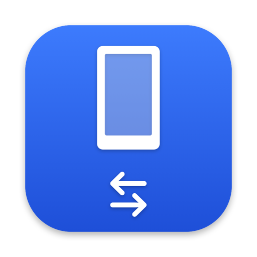

<div align="center">



# Tether

**Move files between your Mac and an Android phone over USB.**<br>
A free, open-source, native replacement for Android File Transfer.

[](https://github.com/r415uk3/Tether/releases/latest)
[](https://github.com/r415uk3/Tether/releases)
[](https://github.com/r415uk3/Tether/actions/workflows/ci.yml)

[](LICENSE)

### [⬇︎ Download for macOS](https://github.com/r415uk3/Tether/releases/latest)

<sub>Universal app for Apple silicon and Intel · English and Russian</sub>

<br>

<picture>
  <source media="(prefers-color-scheme: dark)" srcset="docs/images/browser-dark.png">
  
</picture>

</div>

## Features

<table>
<tr>
<td width="50%" valign="top">

**Finder-style browsing**<br>
List and icon views, thumbnails, Quick Look, sorting by name, size, kind and date.

**Copy both ways**<br>
Drag files and folders in and out, including files larger than 4 GB, with progress, cancel and retry.

**File management**<br>
Rename, delete and create folders on the phone, with a choice to replace or keep both when names clash.

</td>
<td width="50%" valign="top">

**Navigation**<br>
Back and Forward, a path menu on the folder title, and search within the current folder.

**Plays well with macOS**<br>
Eject from the sidebar, a one-click Release when Image Capture or Photos holds the phone, Liquid Glass on macOS 26.

**Built for everyone**<br>
English and Russian, full VoiceOver support, automatic updates, no telemetry.

</td>
</tr>
</table>

## Install

1. Download **Tether-x.y.z.dmg** from [the latest release](https://github.com/r415uk3/Tether/releases/latest) and drag Tether to **Applications**.
2. Open Tether. macOS blocks the first launch because Tether isn't notarized: it's a free project without an Apple Developer ID.
3. Go to **System Settings → Privacy & Security**, click **Open Anyway** next to the Tether message, and confirm.

> [!TIP]
> Comfortable with Terminal? Instead of steps 2–3, run `xattr -dr com.apple.quarantine /Applications/Tether.app`.

**First connection:** plug in the phone, unlock it, and choose **File transfer** in the USB notification. If Image Capture or Photos grabs the phone first, click **Release** in Tether.

**Updates** are built in: Tether checks GitHub for new versions. You can turn this off in Settings → *Check for updates automatically*.

## Privacy

Tether has no analytics or telemetry. Its only network requests are update checks to `r415uk3.github.io` and update downloads from `github.com` (including GitHub's download hosts). Diagnostics stay on your Mac until you copy them.

## По-русски

Tether — бесплатное приложение для macOS, которое копирует файлы между Mac и Android-телефоном по USB. Это замена Android File Transfer: интерфейс полностью на русском, есть VoiceOver и автоматические обновления.

[**Скачать**](https://github.com/r415uk3/Tether/releases/latest): перетащите Tether в «Программы». При первом запуске откройте **Системные настройки → Конфиденциальность и безопасность** и нажмите **Всё равно открыть**, потому что приложение не нотариально заверено. На телефоне выберите **Передача файлов** в уведомлении USB.

<p align="center"></p>

## For developers

<details>
<summary><b>Build from source</b></summary>

<br>

Requirements: Xcode 26 or later (macOS 26 SDK) and Homebrew.

```bash
brew install xcodegen
Vendor/build-libs.sh          # once; builds universal libusb + libmtp into Vendor/build
xcodegen generate             # creates Tether.xcodeproj from project.yml
open Tether.xcodeproj
```

Run with fake phones (no hardware needed) by adding the launch argument `-UseFakeDevices YES` to the Tether scheme, or:

```bash
DerivedData/Build/Products/Debug/Tether.app/Contents/MacOS/Tether -UseFakeDevices YES
```

`scripts/build-release.sh` produces a universal release build and DMG. See [docs/RELEASING.md](docs/RELEASING.md) for the release process.

</details>

<details>
<summary><b>Tests</b></summary>

<br>

```bash
cd Packages/MTPKit
xcodebuild test -scheme MTPKit-Package -destination 'platform=macOS' -derivedDataPath ../../DerivedData/pkg
```

CI runs the package tests through `xcodebuild test`. On Xcode 27 or later `swift test --package-path Packages/MTPKit` works too. Older command-line SwiftPM doesn't compile string catalogs (`.xcstrings`), so there the localization tests fail with "ru.lproj not compiled".

</details>

## License

Tether is released under the [MIT License](LICENSE).

It bundles and dynamically links [libmtp](https://github.com/libmtp/libmtp) and [libusb](https://github.com/libusb/libusb), both under the GNU LGPL v2.1. The About window lists them with the full licence text. You can replace the libraries with your own builds; `Vendor/build-libs.sh` is the exact build script.
