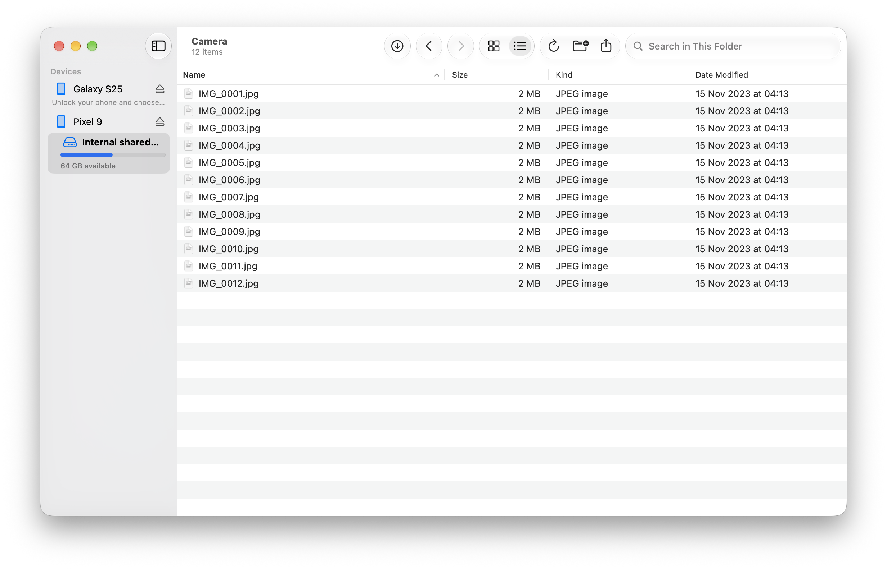
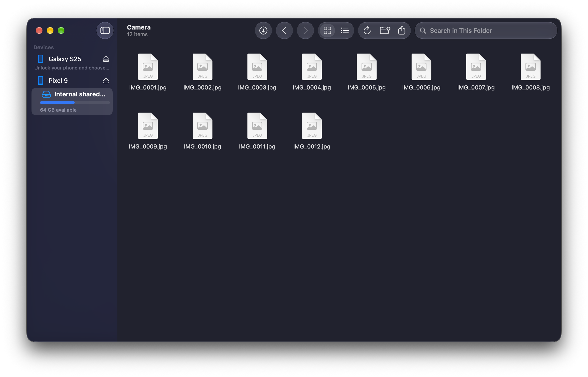
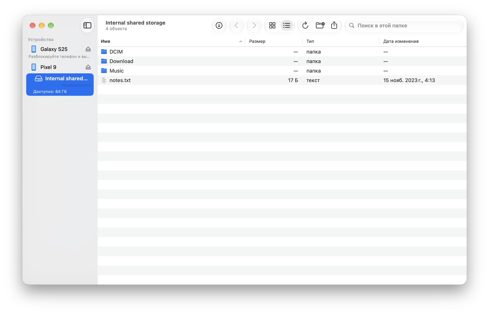

# Tether

## What it is

Tether is a native macOS app for moving files between your Mac and an Android phone over USB (MTP). It is a free, open-source replacement for Android File Transfer, built with SwiftUI and AppKit for macOS 15 and later.



## Screenshots





## Features

- Browse the phone's storage
- Copy files both ways, including files over 4 GB
- Quick Look and thumbnails
- Rename, delete and create folders
- Eject
- Back / Forward navigation and search
- English and Russian interface
- VoiceOver support

## Install

1. Download the DMG from [Releases](https://github.com/r415uk3/Tether/releases) and drag Tether to Applications.
2. Tether isn't notarized (it's a free project without an Apple Developer ID), so macOS blocks the first launch. Open Tether once, then go to **System Settings → Privacy & Security** and click **Open Anyway** next to the Tether message, then confirm.
3. Advanced users can instead run `xattr -dr com.apple.quarantine /Applications/Tether.app`.

## First connection

Unlock the phone and choose "File transfer" in the USB notification. If Image Capture or Photos grabs the phone, use **Release**.

## Updates

Updates are built in: Tether checks GitHub for new versions. You can turn this off in Settings → "Check for updates automatically".

## Privacy

Tether has no analytics or telemetry. The only network requests are update checks to `r415uk3.github.io` and update downloads from `github.com` (including GitHub's download hosts). Diagnostics stay local until you copy them.

## Build from source

Requirements: Xcode 26 or later (macOS 26 SDK), Homebrew.

```bash
brew install xcodegen
Vendor/build-libs.sh          # once; builds universal libusb + libmtp into Vendor/build
xcodegen generate             # creates Tether.xcodeproj from project.yml
open Tether.xcodeproj
```

Run with fake phones (no hardware needed): add the launch argument `-UseFakeDevices YES`
to the Tether scheme, or run
`DerivedData/Build/Products/Debug/Tether.app/Contents/MacOS/Tether -UseFakeDevices YES`.

To produce a release build and DMG, run `scripts/build-release.sh`.

### Tests

```bash
cd Packages/MTPKit
xcodebuild test -scheme MTPKit-Package -destination 'platform=macOS' -derivedDataPath ../../DerivedData/pkg
```

Run the package tests through `xcodebuild test` (this is what CI does), or with `swift test --package-path Packages/MTPKit`
on Xcode 27+. Older command-line SwiftPM does not compile string catalogs (`.xcstrings`), so the localization tests
fail with "ru.lproj not compiled".

## Licence

Tether is released under the [MIT License](LICENSE).

It bundles and dynamically links libmtp and libusb, both under the GNU LGPL v2.1. The About window lists them with the full licence text. You can replace the libraries with your own builds; `Vendor/build-libs.sh` is the exact build script.
